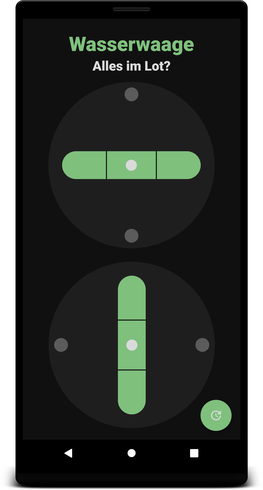
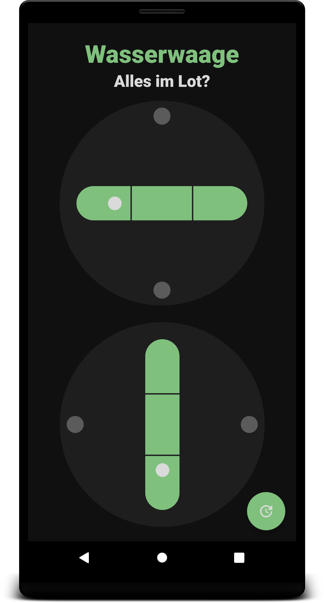

# U09 | Eine Wasserwaage

## Aufgabe

In dieser Aufgabe implementieren Sie eine einfache Wasserwaage für Android-Smartphones. Dazu verwenden Sie den Beschleunigungssensor des Geräts, um aktuelle Messwerte zu dessen Ausrichtung zu erhalten. Die Beschleunigungswerte für die `X`- und `Y`-Achse werden verwendet um die Abweichung der Geräteposition hinsichtlich einer gedachten, planen Oberfläche zu bestimmen (Das verwendete Koordinatensystem wird [hier](https://developer.android.com/reference/android/hardware/SensorEvent#values) noch einmal erklärt). Um eine verlässliche Darstellung zu erreichen, implementieren Sie eine Kalibrierungsfunktion, die die Sensorwerte des Geräts auf einer ebenen Fläche misst, speichert und mit allen zukünftigen Messwerten verrechnet. Dadurch reduziert sich das zu lösende Problem auf die Darstellung der **relativen** Lage des Geräts gegenüber eines vorher festgehaltenen Zustands. Für andere Anwendungsfälle müssen Sie ggf. mehr Aufwand betreiben, um z.B. die relative bzw. Ausrichtung des Geräts innerhalb [eines größeren Bezugsrahmens](https://developer.android.com/guide/topics/sensors/sensors_position#sensors-pos-orient) zu berechnen.

**Hinweis**: Wenn Sie diese App auf einem emulierten Geräte (_Virtual Device_) testen, benötigen Sie die [erweiterten Kontrollmöglichkeiten](https://developer.android.com/studio/run/emulator#extended), um eine Bewegung des Geräts zu simulieren und damit eine Aktualisierung des Beschleunigungssensors auszulösen. Diese sind nur erreichbar, wenn der Emulator **nicht** als _Tool Window_ in _Android Studio_ eingebettet ist. Ändern Sie daher bitte, falls notwendig, die [entsprechende Einstellung](https://androidstudio.googleblog.com/2020/05/emulator-30011-canary.html) in _Android Studio_.

### Vorgaben

Für die Darstellung der Geräteausrichtung haben wir ein sogenanntes [Custom View](https://developer.android.com/training/custom-views/create-view) für Sie vorbereitet. Durch das Erben von `View`- bzw. `ViewGroup`-Klassen und die Verwendung eigene XML-Layouts können Sie in Android neue UI-Komponenten schaffen, die sich hinsichtlich der Konfigurierbarkeit und Integration identisch zu den bereits bekannten Elementen (z.B. dem `TextView`) verhalten. Unser View finden Sie in der Klasse `SpiritLevelView` und den zugehörigen XML-Dateien für das Layout (`res/layout/spirit_level_view.xml`) bzw. den zusätzlich unterstützten XML-Attributen (`res/values/attrs.xml`). Zwei dieser Views sind im Layout der vorgegebene Activity integriert und können für die Anzeige der horizontalen bzw. vertikalen Position verwendet werden. In der Activity können Sie die Views über den "normalen" Weg, d.h. die Verwendung der `findViewById`-Methode referenzieren. Die `SpiritLevelView`-Klasse bietet eine öffentliche Methode an, mit der Sie die Position der Luftblase innerhalb der Wasserwaage programmatisch anpassen können. Die genaue Verwendung ist im vorgegebenen Code in Form von Kommentaren erklärt.

Zusätzlich finden Sie im Layout der Activity einen [Floating Action Button](https://developer.android.com/guide/topics/ui/floating-action-button). Nutzen Sie diesen, um die zu implementierende Kalibrierungsfunktion der App zu starten.

## Vorgehen

Ihre Aufgabe besteht im Wesentlichen daraus, den Beschleunigungssensor des Android-Geräts zu nutzen, um anhand dessen Messwerte die Darstellung der beiden Wasserwagen-Views dynamisch anzupassen. Beim Vorgehen können Sie sich an dieser Empfehlung orientieren:

### Zugriff auf die Sensordaten

Implementieren Sie eine separate Klasse `OrientationProvider`, die den Zugriff auf die Sensordaten kapselt und in der vorhandenen Activity instanziiert wird. Greifen Sie hier auf den Beschleunigungssensor des Geräts zu und registrieren Sie einen entsprechenden Listener, um über neue Messwerte informiert zu werden. Geben Sie zum Testen Ihrer Implementierung die Beschleunigungswerte für die `X`-, `Y`- und `Z`-Achse, die Sie in der `onSensorChanged`-Methode des Listeners erhalten über die `Log.d`-Funktion aus.

**Zwischenziel**: Im *Logcat*-Terminal werden die aktuellen Messwerte des Beschleunigungssensors angezeigt, die sich verändern, wenn das Gerät bewegt wird.

### Starten und Stoppen des Sensors

Die Sensordaten werden nur benötigt, wenn die Activity zum Anzeigen der Wasserwaagen aktiv ist. Implementieren Sie in `OrientationProvider` öffentliche Methoden zum Starten und Stoppen des Providers. Beim Starten soll der notwendig *Listener* für den Beschleunigungssensor registriert werden, beim Stoppen wird dieser entfernt. Verknüpfen Sie den Aufruf dieser Methoden mit sinnvollen Stellen des [Lifecycles](https://developer.android.com/guide/components/activities/activity-lifecycle) der Activity.

**Zwischenziel**: Das Auslesen der Sensordaten ist an den *Lifecycle* der Activity gebunden.

### Weitergabe der Sensordaten an die Activity

Die Messwerte des Beschleunigungssensors werden in der Activity benötigt, um anhand dieser die Darstellung der beiden Wasserwaagen anzupassen. Implementieren Sie eine einfache Listener-Schnittstelle, über die der `OrientationProvider` neue Messwerte an die Activity übergeben kann. Fangen Sie diese in der Activity in einer entsprechenden Callback-Methode ab.

**Zwischenziel**: Neue Messwerte erreichen die Activity und können dort verwende werden.

### Aktualisieren des User Interface

Die Activity erhält nun die aktuellen Messwerte des Beschleunigungssensors. Nutzen Sie die Werte für die Beschleunigung um die `X`- bzw. `Y`-Achse, um die Darstellung der horizontalen bzw. der vertikalen Wasserwaage anzupassen. Analysieren Sie die Messwerte und finden Sie einen Weg, diese auf den Wertebereich `0.0f` bis `1.0f` umzurechnen, den Sie für die Steuerung der `SpiritLevelView`-Elemente benötigen. Übergeben Sie die umgerechneten Werte and die `setBubblePosition`-Methoden der beiden Views, um die aktuelle Lage des Geräts zu visualisieren. Liegt das Gerät auf einer horizontal bzw. vertikal planen Fläche, soll der Wert `0.5f` übergeben werden, um die Luftblase innerhalb der *Libelle* der Waage zu zentrieren.

**Zwischenziel**: Die aktuelle Lage des Geräts wird (genähert) über die beiden vorgegebenen UI-Elemente angezeigt.

### Kalibrierung

Die Rohwerte des Beschleunigungssensors reichen nicht aus, um eine zufriedenstellende Funktion der App zu gewährleisten. Ein Ansatz zur Verbesserung der Datenqualität ist das Kalibrieren der Wasserwaage auf einer planen Fläche. Implementieren Sie eine entsprechende Funktion in der `OrientationProvider`-Klasse, die ausgelöst wird, wenn die NUtzer\*innen auf den _Floating Action Button_ der Activity klicken. Die Kalibrierungsfunktion sorgt dafür, dass die aktuellen Messwerte des Beschleunigungssensors als Referenzwerte gespeichert werden. Vor der Weitergabe neuer Messwerte an den entsprechenden _Listener_ werden diese mit Hilfe der gespeicherten Kalibrierungswerte "normalisiert". Sie können dazu z.B. der bei der Kalibrierung gespeicherten Wert von dem aktuell gemessenen Wert abziehen.

**Zwischenziel**: Die Datenqualität der Messwerte und der Darstellung ist durch die Möglichkeit der Kalibrierung des Sensors gestiegen.

## Screenshots der Anwendung

|  Screenshots der Wasserwage im Ruhezustand   |   Screenshots der Wasserwage auf unebener Fläche    |
|:------:|:-------:|
|   |   |
